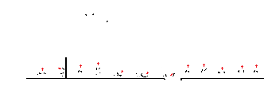
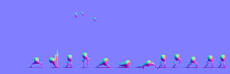
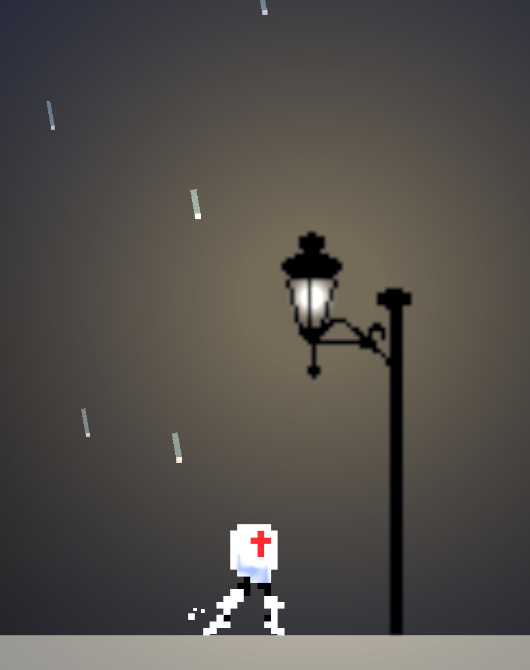

# 概要 
某A君から2Dゲームを作らないかと声をかけられたので見た目部分だけ少しお手伝いする

# 目次
1. [初期状態を確認](#1-初期状態を確認)
2. [なにを作るか](#2-なにを作るか)
3. [シーンにに配置してみる](#3-シーンにに配置してみる)
4. [改善案](#4-改善案)

## 1. 初期状態を確認
**とりあえず送られてきたリポジトリを確認する**  
<video src="V01.mp4" width="500" controls></video>  

## 2. なにを作るか
**見た目部分で手伝ってほしいって言われたけどもうだいぶいい感じ...**  
とりあえずテクスチャので2Dすぎるキャラクターにバンプマップで立体感を作る

 

### NormalMap作成に使ったツール
- テクスチャからNormalMapを生成できるツール[**Laigter**](https://azagaya.itch.io/laigter)

## 3. シーンにに配置してみる  
### ライト周りの設定などをまとめ実際に動作するところまで

 

## 4. 改善案  
- 画素数の極端に少ないドット絵からNormalMapを生成したせいかライトが近いと処理が怪しい
- **※重要** もっと画面をよくできる表現（2D）について研究 