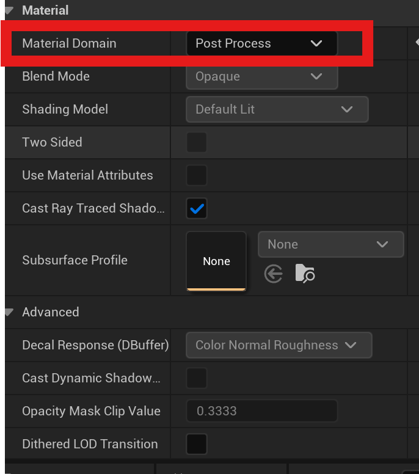
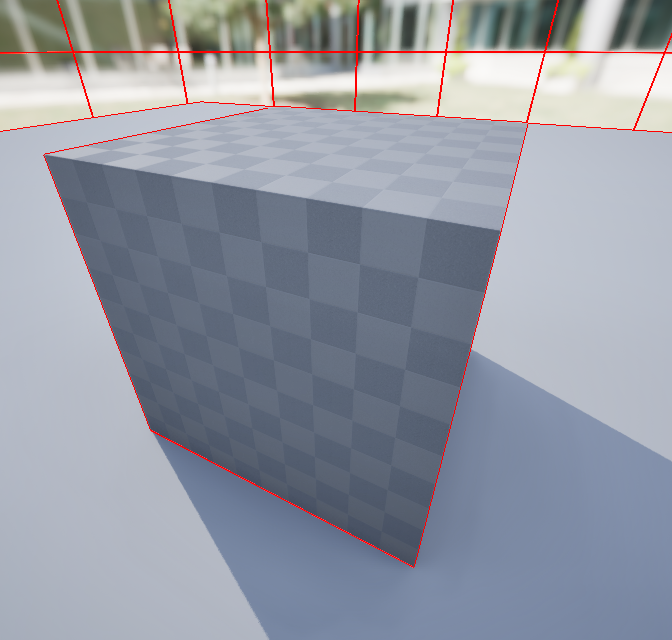

# 概要 
UnrealEngineで遊んでいた時に出来た副産物

# 目次
1. [OutlineShader](#1-OutlineShader)
2. [作ってみる](#2-作ってみる)
3. [実行動画](#3-実行動画)
4. [改善案](#4-改善案)

## 1. OutlineShader
Unrealってどうやったらポストプロセスが作れるんだろうか？  
UnityであればShaderGraphの詳細設定にポストプロセス用の設定があった記憶が...

### やっぱりあった
  

というわけでポストプロセスを何か作りたくなった  

DirectX11で前に作ったOutlineShaderをUnrealでも作れたら復習にもなって一石二鳥  
アウトラインと言ったらこの資料が好き  
https://learning.unity3d.jp/8933/
## 2. 作ってみる

### 流石は輪郭検出ハードエッジにも対応できる  
  

## 3. 実行動画 
<video src="V01.mp4" width="500" controls></video>  

## 4. 改善案  
- カメラの距離に応じてアウトラインの太さを修正しないと違和感が