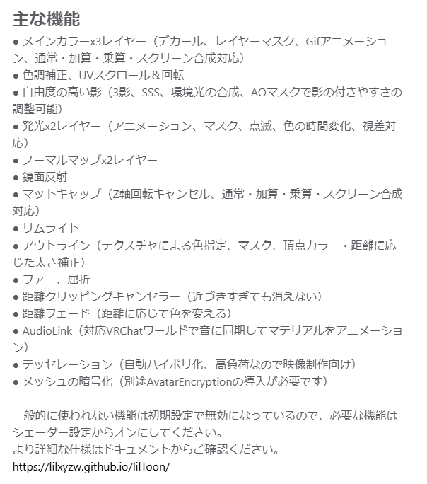
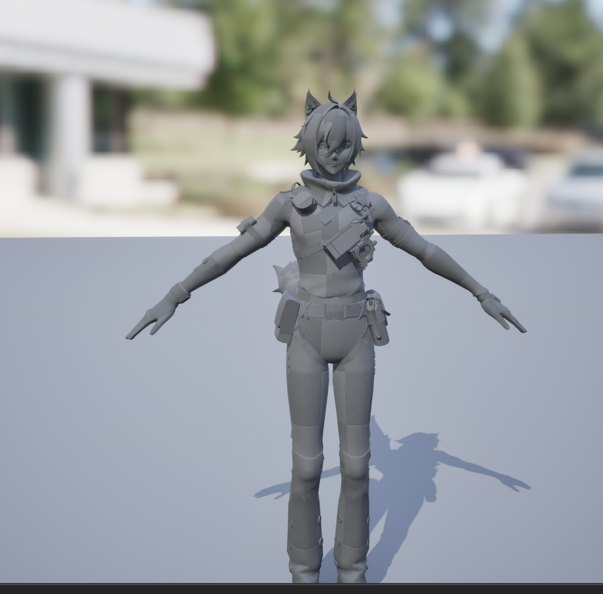
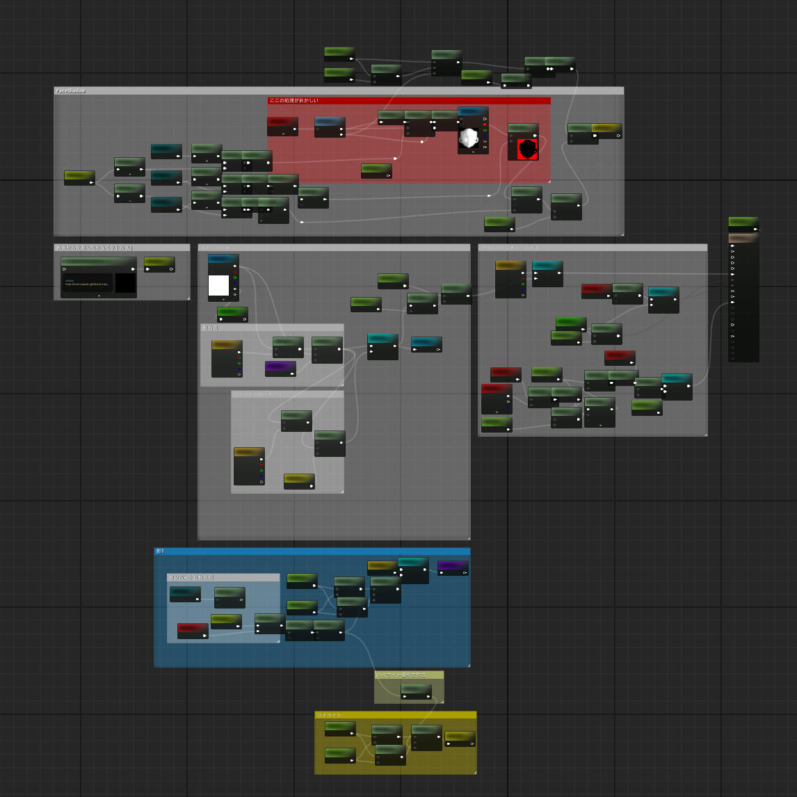
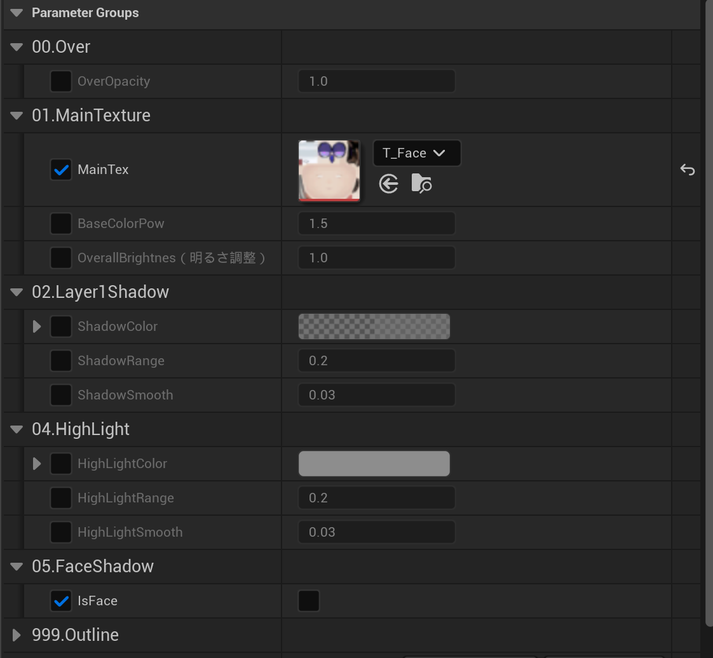

# 概要 
### **マテリアルが作りたい**  

DirectX12でのCPU→GPUへのリソースのストリーミングやオクルージョンカリングなどに挑戦中  
分かってはいたものの全く成果が出ず...  
一旦Unrealとかのゲームエンジンで前からやってみたかったことをやろう  
そこから制作しています。

# 目次
1. [ToonShader](#1-ToonShader)
2. [作ってみる](#2-作ってみる)
3. [レベルに配置してみる](#3-レベルに配置してみる)
4. [改善案](#4-改善案)

--- 
## 1. ToonShader
まずは目指す最終ルックを決めるところから  

現在は非公開  
[CiciToon](https://3dnchu.com/archives/cicitoon-character-shader-pak-v1-0/)  

VRChatなどで使わているらしい  
[lilToon](https://lilxyzw.github.io/lilToon/)  

  

--- 
### どれも機能が多すぎて、全部はマネ出来ないので作りたい要素を選定する
- メインカラーはとりあえず1枚
- 影もレイヤーは1つから
- ハイライト特性
- アウトラインも欲しい（背面法で実装）
--- 
### 必要なもの  
- 3Dモデル（なんでもいいけど.fbxが良い）

--- 
## 2. 作ってみる
モデルを探してると良い感じなのがあんまりない  
そこでHoYoverseがモデルを配信しているとのことでホームページからモデルを拝借  

### ここで問題
配信されていたモデルは拡張子が.pmxでUnrealでは使えない  
でも.pmxを変換できるツールが存在しているらしい  
[BlenderAddOns - MMDTools](https://extensions.blender.org/add-ons/mmd-tools/)  
既にあるものは有難く使わせていただくことにする

--- 

### 実際にUnreal上にインポート
**モデルは問題なくインポートが出来たのでいよいよマテリアルを作っていく**  
  

---  

### マテリアルノード整理をする大切さを学ぶ
想像の5倍ノードがあふれかえって処理が追えなくなる  
これのせいで一度全部作り直してます。。  
  

---  
### パラメータUIを設定使いやすいように！  
  

---

## 3. レベルに配置してみる  
### 気になる点はいくつかある物の結構いい感じなので仮完成！  

<video src="V01.mp4" width="500" controls></video>  

## 4. 改善案  
- FaceShadowを作成したい（処理は作ってるけどバグがあって動かない）
- マットキャップが欲しい
- その他レイヤーを追加したり、AOマップなどにも対応させたい