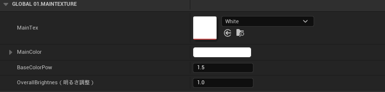
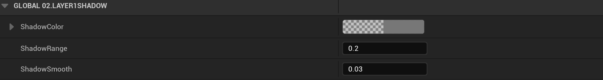
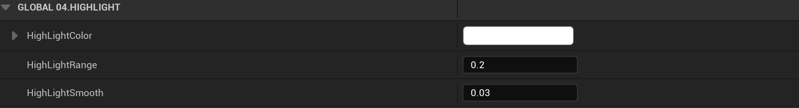
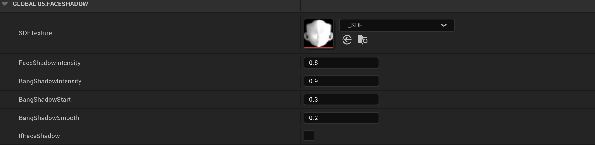
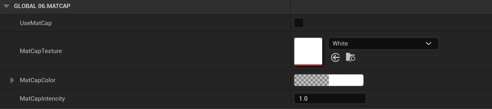
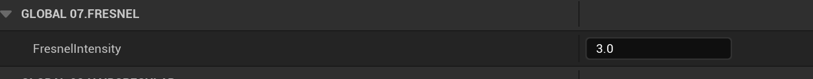
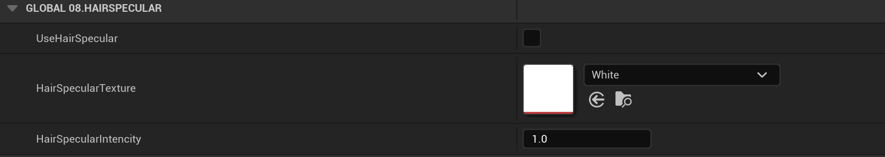
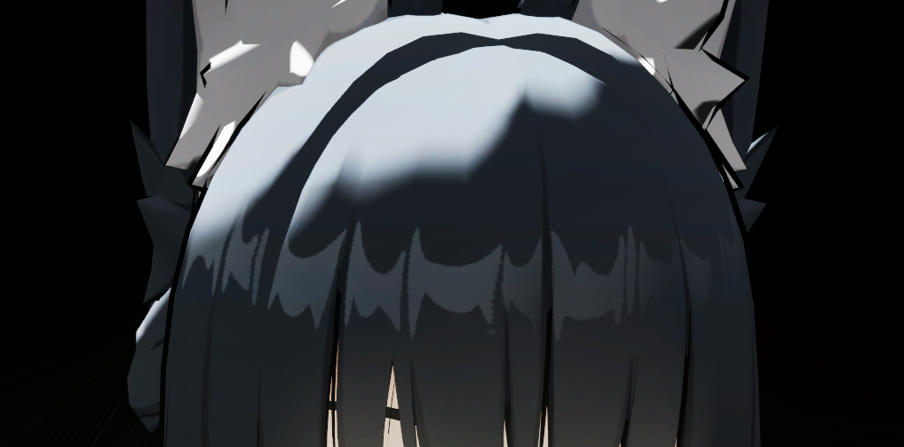
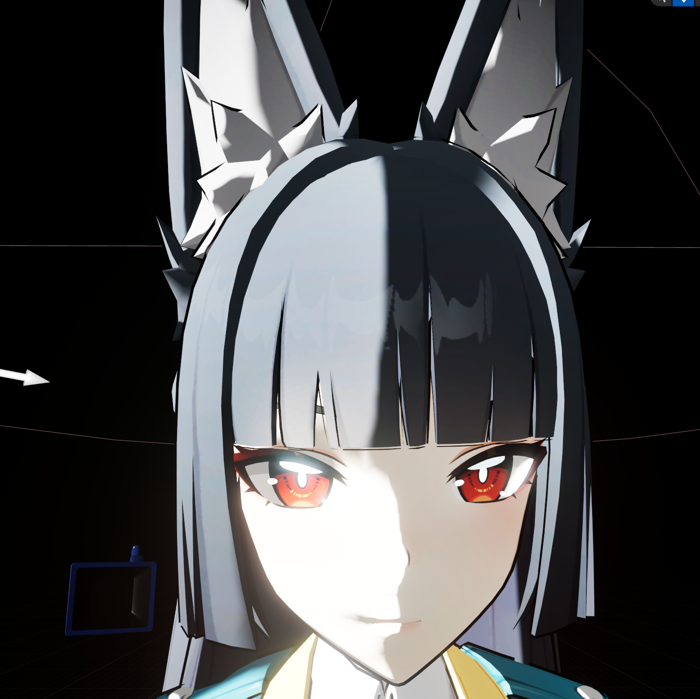
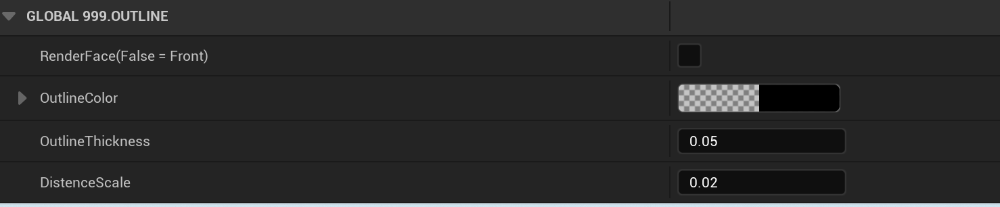

# 目次
1. [ToonShader](#1-ToonShader)
2. [機能一覧](#2-機能一覧)
3. [今後の発展案](#3-今後の発展案)

--- 
## 1. ToonShader
## 大まかな基本解説
- Layer1Shadow、BaseColor、Highlightの三分割シェーディング  
- 顔部分のFaceShadow、MatCapに対応（別途SDFTextureが必要）
- 部位ごとのOutline設定可能  
HoYoverseがモデルを配信しているとのことでホームページからモデルを拝借  

<video src="V01.mp4" width="500" controls></video>  

## 2. 機能一覧 

### 1.MainColor
- 基本となる色を決定する  
- ベースのテクスチャと、乗算カラーを設定可能

### 2.Layer1Shadow
- 基本色はテクスチャではなくパラメータでの調整  
- 影の幅、通常色との補完可能

### 3.Layer2Shadow(2と同じ、現在撤去中)

### 4.HighLight
- 基本はShadowと同じ、幅、補完係数を準備、明るさを調整可能  

### 5.FaceShadow
- SDFテクスチャを利用して顔のライティングを調整可能
- BangShadow(おでこにの当たりの影)を設定可能
- ifで処理分岐、FaceShadowが不要な場合は処理が走らないので負荷を気にする必要なし

### 6.MapCap
MatCapとは（https://note.com/mishoji_yuki/n/n1554fd51f57a）
- MatCapTextureに対応、キャラ装飾などに利用できる
- 上記と同じで処理分岐を追加

### 7.Fresnel
  

### 8.HairSpecular
- ライトの当たり具合に応じて表示強度（アルファ）が調整可能

  
  

### 9.Over
- OverOpacity（浮動小数）
- 目のハイライトなど光る部分を設定可能

### 999.OutLine
- 背面法での部位毎のアウトライン表示
- カメラ距離に合わせて太さが自動調整  

## 3. 今後の発展案 

- Layer1ShadowにShadowTextureを使用できるように
