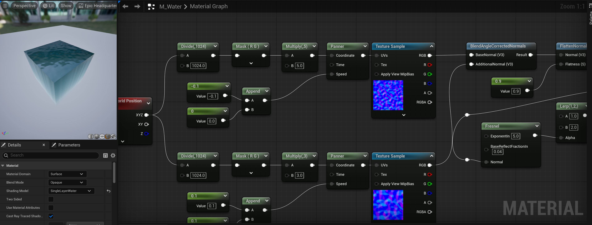
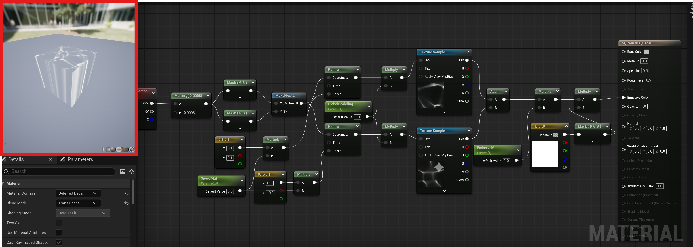

# 概要 
UnrealEngineの授業でMaterialを使ったので復習がてらやってみたかった表現を作ろう 

# 目次
1. [水Materialとコースティクス](#1-水Materialとコースティクス)
2. [作ってみる](#2-作ってみる)
1. [レベルに配置してみる](#3-レベルに配置してみる)
1. [改善案](#4-改善案)

--- 
## 1. 水Materialとコースティクス
まずは水のマテリアルから作成していく  
UnityのShaderGraphでそれっぽいのを見たことがある（シリコンスタジオインターン）ので、  
思い出しつつ、[参考資料](https://anogame.net/stylized-water-shader-graph/)を読み漁って形を作る  

 

### 最初からそれっぽいのが出来たのでコースティクスも作って合わせてみる

それっぽいのを考えるとボノロイノイズを2枚くらいスクロールできればいいかも  
板ポリを作ってマテリアルを適応して置いてもいいけど出来るならUnityにあるデカールみたいなのが欲しい...  
  
### あった [**デカールマテリアルリファレンス**](https://dev.epicgames.com/documentation/ja-jp/unreal-enginedecal-materials-in-unreal-engine)  

--- 
### 必要なもの  
- ノイズテクスチャ   

--- 
## 2. 作ってみる

素材がテクスチャだけならAIでも作れないかな  

### **普通に出来た**
  

### 後はノードを組んでみる  
これもインターンで見たので参考にしつつ構成  
  

### 赤枠の通り縦方向はぐちゃぐちゃになるけど、デカール自体を回転させればいいので完成！

## 3. レベルに配置してみる  
### 気になる点はいくつかある物の結構いい感じなので仮完成！  

<video src="V01.mp4" width="500" controls></video>  

## 4. 改善案  
- ノイズテクスチャよーく見ると右端にGeminiで生成したマークが...
- ノイズが完全にリピートなので違和感
- 浅い部分と深い部分を作ってグラデーションする（カメラ位置から水面までの距離と地面まで厚さを計算）
- 当然内側から見たときのことなんて考慮していないので、そっちの見た目も作る！